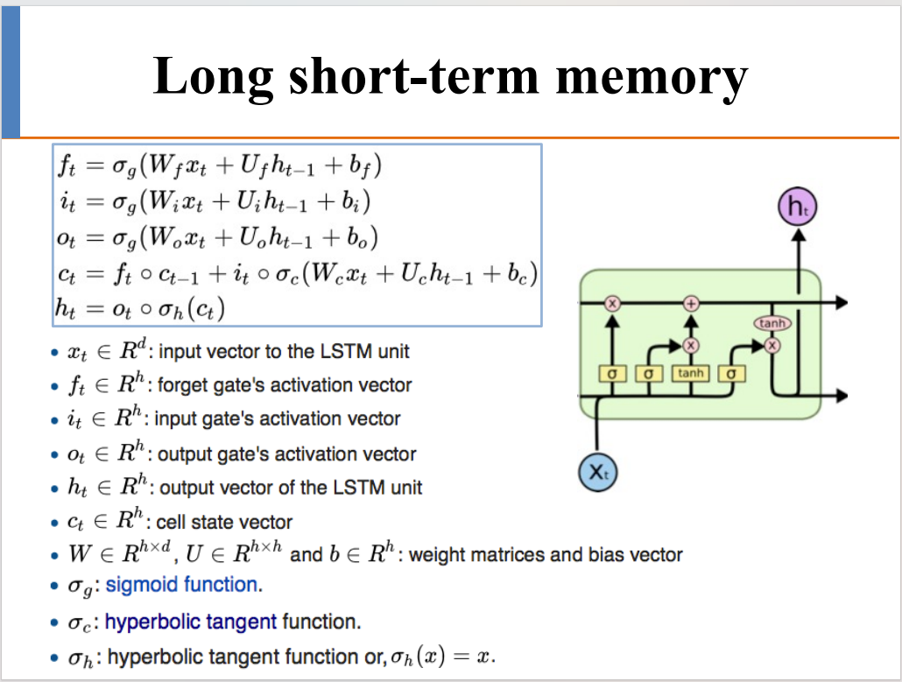

## LSTM
### Background
* RNN在处理长序列时存在的两个问题
  * 梯度消失问题或者梯度爆炸
  * 长期依赖问题：递归神经网络只能处理我们需要较接近的下文的情况
  
### 意义
* 判断不同信息的价值，发现关键词（特征）
* 避免距离较远的有用信息丢失

### component

* BASIC CONCEPT
  * **h t** 当前单元的输出
  * **C t** 当前单元的状态 可理解为记忆
  * **x t** 当前单元的输入
* gate
  * 都是依据当前输入**x t**，与上一时刻的输出 **h t-1** 来计算
  * forgetgate
    * 根据当前输入 **c t** ，与上一时刻的输出 **h t-1** 决定遗忘哪些信息
    * 整合后的向量 位置上为0 则遗忘掉该位置的信息
  * input gate
    * tanh函数进行信息提取
    * sigmoid函数进行筛选评级，越高优先级的信息将过多的进入单元状态（类似forget门）
  * output gate : 
    * 把当前输入，与上一时刻的输出 输到神经网络中
    * 输出将于当前时刻的**tanh（C t）**进行点乘运算得到输出

### 变体
* 将 **c t-1** 也加入到gate运算中