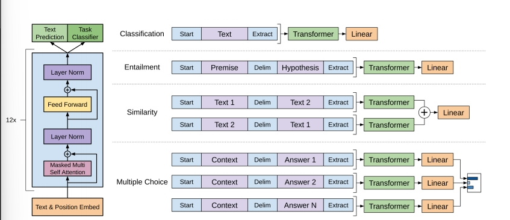

## Generative Pre-Train 
### Improving Language Understanding by Generative Pre-Training
#### Abastract
* 针对特定任务的数据是scarce的
* 希望能够通过预训练以及微调来使得在无标签数据中学到的表征传递到子任务
#### Introduce
* Unlabeled text 
  * difficuty
    * Optimization objective 没有一个目标函数能够适应所以任务，每个目标函数都有对应的任务
    * 如何将学到的表示传递给子任务
*  GPT：a semi-supervised approach
  可以分为以下部分：
   *  unsupervised pre-training：Based on unlabeled corpus(语料库).
   *  supervised fine-tuning
* Framework：Transformer
#### FrameWork
* Unsupervised pre-train
  *  根据之前的k（context）个词 预测下一个词
  *  相较于BERT，更难的任务，更难训练，但是能力更强

输入内容为onehot矩阵，经过词嵌入矩阵，最后输出softmax
**PS：最后的生成结果仍然是概率分布**
* Supervised fine-turn
  
* Task-specific input transformations 根据任务采用不同结构
  * 分类
  * 蕴含
  * 相似
  * 多项选择题

#### Training
* Dataset : BooksCorpus
* Model ： 12-layer decoder-only transformer with masked self-attention heads (768 dimensional states and 12
attention heads)

### GPT-2 Language Model are unsipervised Multitask Learners
**扩大参数量**
#### Abstract
* new dataset : WebText
* Zero-shot 在下游任务 不使用标记过的数据来微调
#### Introduce
* Zero-shot setting ：without any parameter or architecture modification.
#### Approach
* Dataset ： **Reddit, a social media platform, which received at least 3 karma**和其他文本组成 ==》 **WebText**
* Input Representation : 为了能够对所有字符串进行预测，采用**Byte Pair Encoding**
  * **Byte Pair Encoding**通常用于对文本进行分词（tokenization）或者对单词进行子词分解（subword tokenization）
  * 对BPE的优化
  * 
####  Experience

#### Generalization vs Memorization

### GPT-3 Language Model are Few-Shot learners
#### Abstract
* 在下游任务不做微调和更新
* 生成人类难以辨别的文章

#### Introduce
* 在预训练模型应用在下游任务时存在问题
  * 需要大的数据集
  * 微调后的效果好 不代表模型的预训练结果好 可能是过拟合到预训练文本上，预训练文本与下游任务文本重合度大
  * 人类并不需要大量数据集来学习
* Meta-learning
* in-context-learning
* 不同shot-learning 的比较
#### Framework
* Sparse Transformer
* Dataset Commom Crawl
    * 基于GPT-2的内容 对commom crawl 做二分类，正类留下
    * 对文本进行相似度判断，去重
* Beansearch 来得到生成答案

#### Potential Impact
- Potential Misuse
- Fair Bias Reprecentation：gender ，race，religion
- Energy use

### GPT-4 Tech report
* Predicatable scalling
  * OpenAI 可以从在小规模模型的训练上预测大模型的训练结果，减少成本
  * 通过小模型的结果 外推
  * 并不是所有的任务都是如此，大模型的涌现现象仍然存在（Hindsight negiect）
* RLHF
* Visual inputs
* Steerability
  * System message :定义AI的身份

### Append
* zero-shot ： 预训练完模型后 不需要样本直接适应下游任务
* one-shot ：预训练完模型后 使用一个样本直接适应下游任务
* few-shot ：预训练完模型后 采样部分样本直接适应下游任务

### Append.疯狂三月
* Chatgpt plugin ToolFormer
* LLaMA
* Visual Chatgpt
* GigaGAN
* Stanford Alpaca
### 计划
5.5结束
* GPT模型
* 训练方法
* GPT-4多模态

